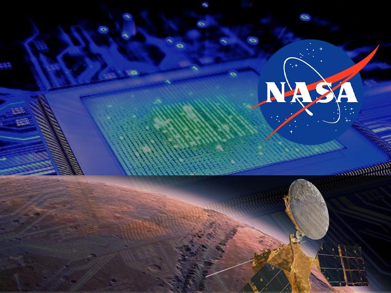
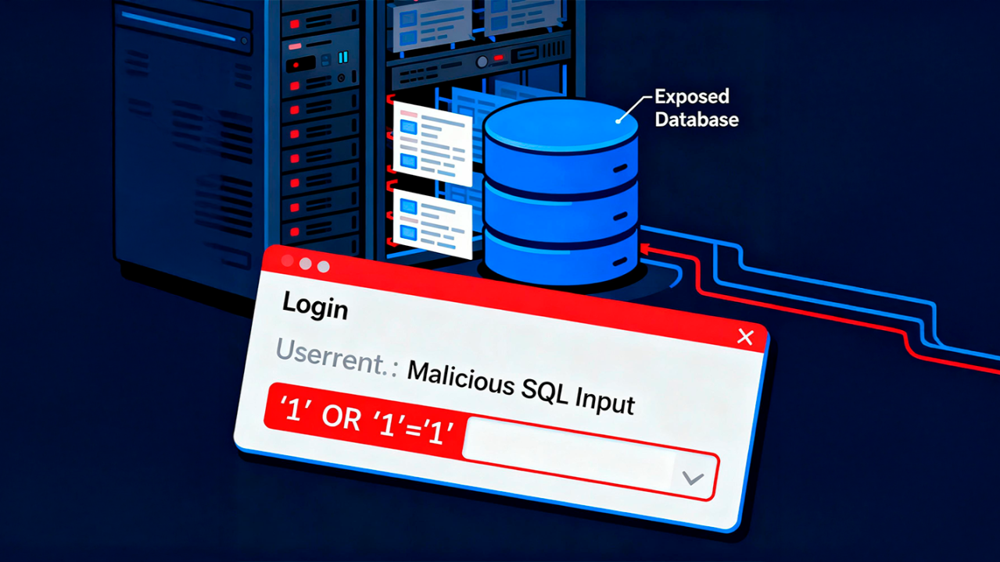
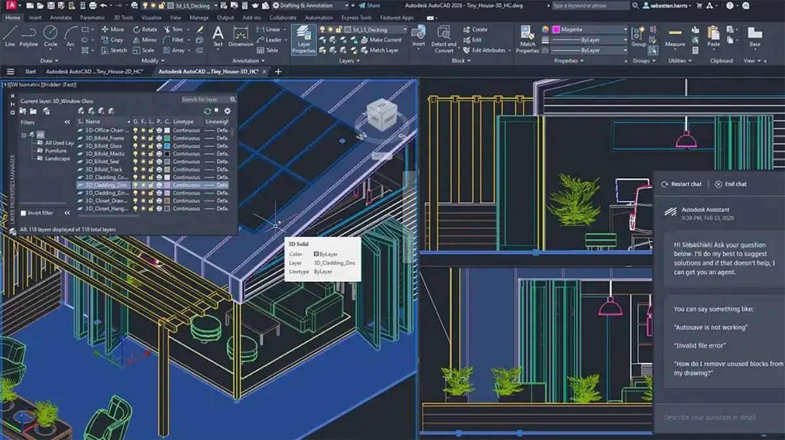
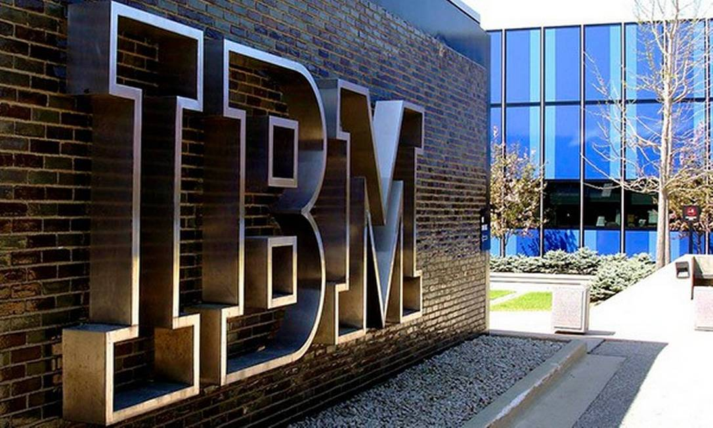

# Spiral-Model

## Instituição De Ensino 
* **Serviço Nacional de Aprendizagem Industrial (SENAI)**
-----------
## Instrutor 
* **Frederico Martins Aguiar**
--------
## Integrantes 
* **Alice Virgília Andrade**
* **Bruo Maia Santos**
* **Diulie Mileide Batista Correia** 
------
 * **Repositório do Grupo 01 para estudo da metodologia Spiral Model.  O projeto apresenta análise da metodologia, características, vantagens e desvantagens, ferramentas associadas e exemplos de aplicação em projetos de desenvolvimento de software.  Inclui documento técnico em PDF e materiais da apresentação.**

----
## Barry Boehm

Barry W. Boehm (1935–2022) foi um engenheiro de software e cientista da computação norte-americano, reconhecido como um dos fundadores da engenharia de software moderna. Seu trabalho influenciou profundamente a estimativa de custos, o gerenciamento de riscos e os modelos de ciclo de vida de software.

### Principais fatos
Nascimento: 16 de maio de 1935, EUA

Falecimento: 20 de agosto de 2022, Santa Monica, Califórnia

Instituições: University of Southern California, RAND Corporation, TRW Inc., DARPA

Modelos notáveis: COCOMO, Modelo Espiral de Desenvolvimento de Software

Livro seminal: Software Engineering Economics (1981)

### Contribuições e legado
Boehm revolucionou a disciplina ao propor o Constructive Cost Model (COCOMO), o primeiro método amplamente adotado para estimar custos e prazos de projetos de software com base em dados empíricos. O modelo possibilitou melhor controle de cronogramas e orçamentos em sistemas complexos, tornando-se referência global por décadas.

Ele também criou o Modelo Espiral de Ciclo de Vida, um paradigma iterativo que combina desenvolvimento incremental e gerenciamento de riscos, influenciando práticas ágeis e processos modernos de engenharia de sistemas.

Carreira acadêmica e prêmios
Professor distinto na Universidade do Sul da Califórnia, Boehm dirigiu o Center for Systems and Software Engineering e orientou mais de quarenta doutorandos. Foi eleito membro da National Academy of Engineering (1996) e fellow do IEEE, ACM e INCOSE. Recebeu prêmios como o IEEE Simon Ramo Medal (2010) e o INCOSE Pioneer Award (2019) 
.

### Influência e memória
Conhecido por sua generosidade intelectual e entusiasmo docente, Boehm moldou gerações de engenheiros e pesquisadores. Seu legado continua vivo por meio do Boehm Center for Systems and Software Engineering, dedicado à pesquisa em práticas e estimativas de desenvolvimento de sistemas

## 1. Definição do Spiral Model

O Spiral Model foi criado em 1986 pelo engenheiro de software Barry Boehm.
Ele combina características de dois modelos clássicos:
Waterfall Model (modelo em cascata)

A principal característica do modelo espiral é que o desenvolvimento ocorre em ciclos repetitivos chamados de espirais, onde cada ciclo envolve:
planejamento

- análise de riscos
- desenvolvimento
- avaliação com o cliente

Ou seja, o projeto evolui gradualmente, sempre avaliando riscos antes de avançar.
-----
## 2. Características Principais
As principais características do Spiral Model são:
**Desenvolvimento em ciclos**
O projeto evolui em várias voltas da espiral, cada uma produzindo melhorias.
**Foco na análise de risco**
Antes de desenvolver algo novo, o time analisa riscos técnicos, financeiros e operacionais.
**Feedback constante**
O cliente avalia cada versão intermediária do sistema.
**Iteração contínua**
Cada ciclo pode gerar protótipos ou novas funcionalidades.
**Flexibilidade**
Permite ajustes ao longo do projeto.

-----
## 3. Como funciona o Modelo Espiral
Cada volta da espiral possui quatro etapas principais:
 Planejamento
Definição de objetivos e funcionalidades da próxima etapa.
 Análise de riscos
Avaliação de possíveis problemas técnicos ou de negócio.
 Engenharia
Desenvolvimento e testes das funcionalidades.
 Avaliação do cliente
O cliente valida o que foi produzido.
Depois disso, inicia-se uma nova espiral, aprimorando o sistema.

-----
## 4. Tipos de Projetos Mais Adequados
O Spiral Model é mais indicado para projetos:
Grandes, que exigem validação frequente, com requisitos que podem mudar
Exemplos comuns:

- Sistemas de Gestão

- Softwares corporativos grandes

- plataformas complexas de TI
  
-----

## 5. Ferramentas 
Ferramentas comuns de engenharia de software.

### Gestão de projeto

.Jira
.Trello
.Asana

### Controle de versão

.Git
.GitHub
.GitLab

### Integração contínua

.Jenkins
.Travis CI

### Modelagem
.Lucidchart
.draw.io

------

## 6. Vantagens do Spiral Model

* Forte controle de riscos

* Permite identificar problemas antes que eles se tornem críticos.
Flexibilidade

* Requisitos podem ser ajustados ao longo do projeto.
Qualidade maior

* Cada ciclo inclui testes e validação.
Envolvimento do cliente

* O cliente acompanha o desenvolvimento de perto.
-------
# 7. Desvantagens do Spiral Model

* Alto custo:  Pode ser caro para projetos pequenos.
* Complexidade de gestão : Exige planejamento detalhado e especialistas.
* Não indicado para projetos simples : Modelos mais simples podem ser mais eficientes.
* Difícil estimar tempo total:Como há várias iterações, o prazo pode variar.

--------
# 8. Exemplos de Aplicação no Mundo Real
O Spiral Model é utilizado em projetos com alto risco tecnológico.
Exemplos:
## Sistema Operacional ##
* Organizações como a NASA utilizam processos iterativos com análise de risco.

## Sistemas de defesa ##
* Projetos militares costumam usar modelos baseados no Spiral Model.

## Grandes softwares corporativos ##
* Empresas como IBM utilizam abordagens iterativas inspiradas nesse modelo.

# 9. Comparação com Outras Metodologias
Cascata (Waterfall):

O modelo Waterfall é estritamente sequencial, exigindo que cada fase seja concluída antes da próxima. Já o modelo Spiral é iterativo, permitindo refinamentos contínuos através de ciclos de prototipagem e análise de riscos. Essa diferença torna a espiral muito mais adaptável a mudanças do que a rigidez da cascata.

Agile:

O modelo Waterfall é rígido e sequencial, enquanto o Spiral é iterativo e focado em riscos. Já os métodos ágeis, como o Scrum, são ainda mais flexíveis e rápidos, priorizando entregas incrementais e adaptação constante às necessidades do cliente.

Kanban:

O modelo Spiral foca na gestão detalhada de riscos através de ciclos iterativos, enquanto o Agile prioriza entregas rápidas e incrementais para responder rapidamente às mudanças. Diferente da estrutura controlada da espiral, o Agile aposta na flexibilidade máxima para evoluir o produto conforme o feedback contínuo do cliente.

-----------
## Conclusão:

* O Spiral Model é uma metodologia poderosa para projetos complexos. Ele combina planejamento estruturado com desenvolvimento iterativo, garantindo maior controle de riscos e qualidade no produto final. Apesar de ser mais complexo e custoso, é extremamente útil em projetos onde falhas podem gerar grandes impactos.
Por isso, continua sendo uma referência importante na engenharia de software moderna.

## Caso de Uso:

A empresa popular que utilizou princípios do Spiral Model foi a IBM.
Softwares exemplos:
## IBM Rational Suite:
* Ele integra soluções para gestão de requisitos, modelagem visual, desenvolvimento, teste e controle de mudanças, visando aumentar a qualidade, reduzir custos e riscos.
## IBM WebSphere:
* Ele funciona como uma base robusta para conectar aplicações, serviços e dados, sendo amplamente utilizado por empresas para rodar sistemas críticos de alto desempenho.

-----------
## Referências Bibliográficas:

* https://diversedaily.com/exploring-the-spiral-model-combining-waterfall-and-iterative-development-with-emphasis-on-risk-management-and-incremental-releases/?utm_source=chatgpt.com
* https://en.wikipedia.org/wiki/Spiral_model
* https://blog.logrocket.com/product-management/risk-driven-development-with-the-spiral-model/
